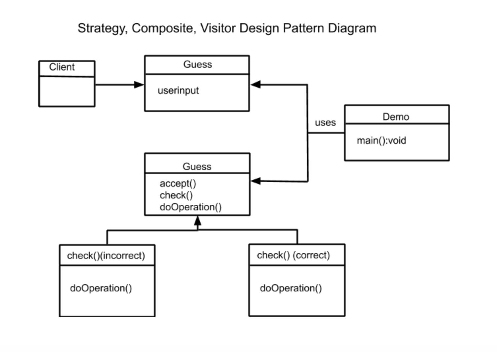

# CS 100 Programming Project
A) Group Members: Mariam Razak (mraza008@ucr.edu) and Maya Fall (mfall003@ucr.edu)

B) Title of Project: Hangman

C) What it is: What it is: We will be working on a hangman game in terminal. The user will guess letters of a work and either be correct in which case a space of the blank will be filled in, or be incorrect in which case the next part of the 'man' will be drawn. 

D) This game will be interesting because it will help the reader increase their spelling and word recognition abilities. It will also allow the user to choose themed words (ie Shakespere or Harry Potter), making the game more personalized and fun for the individual. 

E) We plan to use C++, GitHub, textfiles, and PuTTy/terminal for now. 

F) The input is the user input from the keys guessing (letters), and the output is what is drawn on the screen and added to the blank (where the letters will be filled in as the user guesses). 

 

Diagram Description: We are using the Strategy design pattern to recongnize the different functions needed based on whether or not the guess was correct. We are using the Visitor design pattern to select which specific function, and the Composite pattern to take in guesses and then check and modify them on whether or not they are correct. This allows all 3 patterns to work together. 
